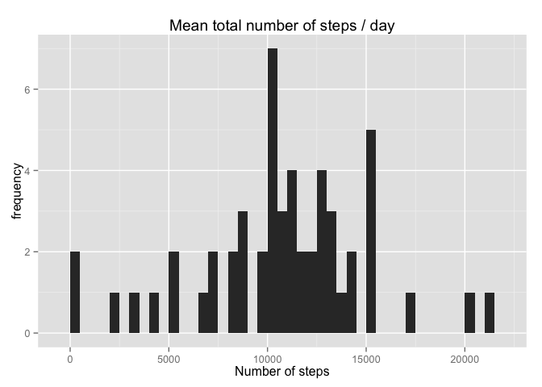
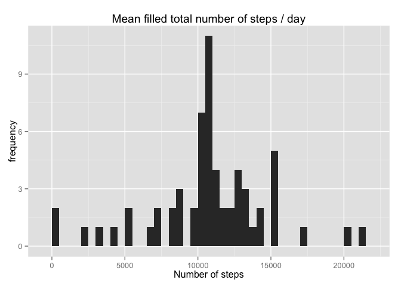
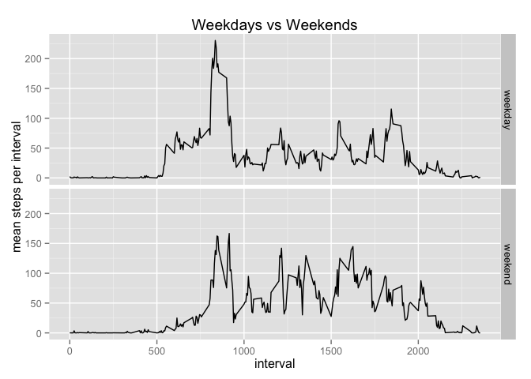

# Reproducible Research: Peer Assessment 1
##Loading helper libraries and setting up global options first
We load the libraries that we will use further down in the analysis. These are 'dplyr' and 'ggplot2'.
We also set echo as true for all the chunks. This requires the knitr library to be loaded.

```r
library(dplyr)
library(ggplot2)
library(knitr)
opts_chunk$set(echo=TRUE, results='asis')
```


## Loading and preprocessing the data
We load the data with  read.csv(). The assumption is that the data reside in the same directory as this R.markdown file.

```r
activity <- read.csv("activity.csv")
```

## What is mean total number of steps taken per day?


```r
activity_per_day <- group_by(activity, date)
total_activity_per_day <- summarise(activity_per_day, total_steps = sum(steps))
ggplot(total_activity_per_day, aes(total_steps))+stat_bin(binwidth=500)+labs(title="Mean total number of steps / day", x ="Number of steps", y="frequency")
```

 

```r
mean_activity_per_day <- summarise(total_activity_per_day, mean_steps = mean(total_steps, na.rm = TRUE))
median_activity_per_day <- summarise(total_activity_per_day, median_steps = median(total_steps,na.rm = TRUE))
```

>The mean steps per day are: **10766**  while the median steps per day are: **10765**


## What is the average daily activity pattern?

```r
steps_per_interval <- group_by(activity, interval)
mean_steps_per_interval <- summarise(steps_per_interval,mean_steps = mean(steps, na.rm=TRUE))

ggplot(mean_steps_per_interval, aes(interval, mean_steps))+labs(title="Average daily activity", x="Time(min)", y="steps")+geom_line()
```

 

```r
mx <- max(mean_steps_per_interval$mean_steps, na.rm=TRUE)
mean_steps_per_interval[mean_steps_per_interval$mean_steps == mx,]
```

Source: local data frame [1 x 2]

  interval mean_steps
1      835   206.1698


## Imputing missing values
We calculate the number of NA instances first.

```r
nas <- nrow(activity[is.na(activity$steps),])
```
>The number of NA values in the 'steps' variable is: **2304**

Then we replace NA's in the 'steps' variable with the average number of steps per interval and we print a few rows to get a feeling of the results.


```r
activity_filled <- inner_join(activity, mean_steps_per_interval)
```

```
## Joining by: "interval"
```

```r
for(i in seq(1:nrow(activity_filled))){
        if(is.na(activity_filled[i,"steps"])){
                activity_filled[i,"steps"] <- activity_filled[i,"mean_steps"]
        }
}
activity_filled <- activity_filled[,-c(4)]
head(activity_filled)
```

```
##   interval     steps       date
## 1        0 1.7169811 2012-10-01
## 2        5 0.3396226 2012-10-01
## 3       10 0.1320755 2012-10-01
## 4       15 0.1509434 2012-10-01
## 5       20 0.0754717 2012-10-01
## 6       25 2.0943396 2012-10-01
```
Then we make a histogram and calculate mean and median again, to compare with our initial results

```r
activity_per_day_filled <- group_by(activity_filled, date)
total_activity_per_day_filled  <- summarise(activity_per_day_filled, total_steps = sum(steps))
ggplot(total_activity_per_day_filled , aes(total_steps))+stat_bin(binwidth=500)+labs(title="Mean filled total number of steps / day", x ="Number of steps", y="frequency")
```

 

```r
mean_activity_per_day_filled  <- summarise(total_activity_per_day_filled , mean_steps = mean(total_steps, na.rm = TRUE))
median_activity_per_day_filled  <- summarise(total_activity_per_day_filled, median_steps = median(total_steps,na.rm = TRUE))
```

>The mean steps per day now are: **10766** which is the same as before,  while the median steps per day are: **10766** which is slightly different than the previous one


## Are there differences in activity patterns between weekdays and weekends?


```r
activity_per_day_filled[,"daytype"] <- weekdays(as.Date(activity_per_day_filled$date), abbreviate=TRUE)
activity_per_day_filled[activity_per_day_filled$daytype %in% c("Sun","Sat"),"daytype"] <- "weekend"
activity_per_day_filled[activity_per_day_filled$daytype %in% c("Mon","Tue","Wed","Thu","Fri"),"daytype"] <- "weekday"
activity_per_day_filled <- group_by(activity_per_day_filled, interval,daytype)
mean_activity_per_day_filled <- summarise(activity_per_day_filled, mean_steps =mean(steps))
ggplot(mean_activity_per_day_filled, aes(interval,mean_steps))+geom_line()+facet_grid(daytype ~.)+labs(title="Weekdays vs Weekends", y="mean steps per interval")
```

 

